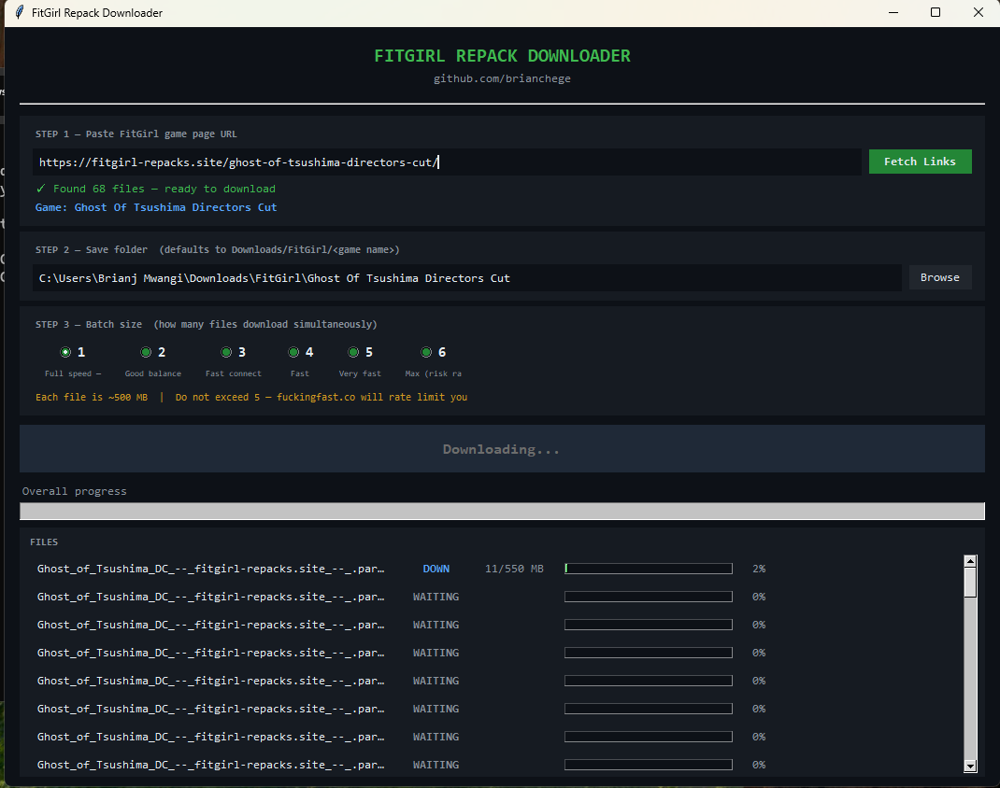

# FitGirl Repack Downloader

A simple GUI tool to automatically download FitGirl repacks from fuckingfast.co.  
No IDM needed. Just paste a link and go.

---

## How It Works

### Step 1 — Find your game on FitGirl Repacks


Go to [fitgirl-repacks.site](https://fitgirl-repacks.site), find your game and copy the page URL from your browser.

<<<<<<< HEAD

=======


Use the **FuckingFast** mirror links — that's what this tool downloads from.
>>>>>>> 474a2a8262d57248a69c16b9472c33e4b873e3fd

---

### Step 2 — Paste the URL and fetch links

<<<<<<< HEAD

=======


>>>>>>> 474a2a8262d57248a69c16b9472c33e4b873e3fd

Paste the game page URL, click **Fetch Links**, choose your save folder and batch size, then hit **START DOWNLOAD**.

---

## Setup

1. Install [Python 3.8+](https://www.python.org/downloads/) — tick **"Add to PATH"** during install
2. Double-click **`START.bat`** — installs dependencies and launches the app

That's it.

---

## Features

- Auto-fetches all fuckingfast download links from any FitGirl page
- Skips language packs automatically
- Skips already downloaded files — safe to stop and resume anytime
- Auto-retries failed downloads (3 attempts)
- Overall progress bar and live log
- Defaults save folder to `Downloads/FitGirl`
- Works overnight unattended

---

## Tips

- **Batch size 1** = full speed on slow connections (recommended)
- **Batch size 2-3** = good on fast connections
- **Never go above 5** — fuckingfast.co will rate limit you
- If something fails, just rerun — already downloaded files are skipped

---

## Project Structure

```
fitgirl-repack-downloader/
├── main.py            # GUI app
├── START.bat          # double-click to launch
├── requirements.txt
├── screenshots/       # add your screenshots here
│   ├── fitgirl-page.png
│   └── gui.png
└── README.md
```

---

## License

MIT
